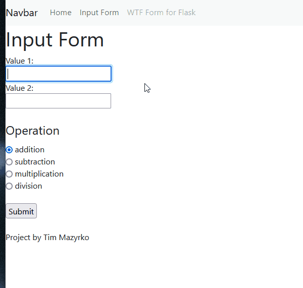

# IS218 Calculator Project

## Project Setup

To run tests, Lint, and Coverage report use this command:

pytest  --pylint --cov

_.pylintrc is the config for pylint_ 
_.coveragerc is the config for coverage_ 
_setup.py is a config file for pytest_

## Flash Message Demo

